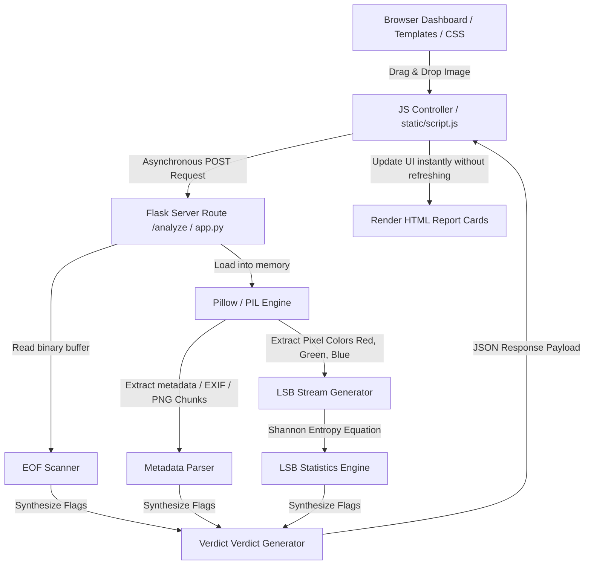

# Steganography Detector: Forensic Image Analysis Tool

A lightweight, modern, and highly educational **Forensic Image Steganalysis Web Application** designed as a Python mini-project. 

This project allows users to upload standard images (`.jpg`, `.jpeg`, `.png`) to a clean, minimal, single-page dashboard. The backend performs active, multi-layered forensic inspection to analyze the image's structural, metadata, and pixel-level configurations. It provides a real-time, functional diagnosis classifying the image as **clean** or **suspicious** with clear, mathematical, and logical justifications.

---

## 1. Core Steganographic Concepts Explained

To understand this project, you must first understand **Steganography** versus **Steganalysis**:
* **Steganography** is the art and science of hiding a secret message, file, or data *within* another non-secret file (like an image) so that its very existence is concealed. It differs from Cryptography, which scrambles a message to make it unreadable but does not hide the fact that a message exists.
* **Steganalysis** is the counter-science of detecting the presence of hidden steganographic payloads. This project is a **steganalysis tool**.

Our detector uses three primary forensic methods:

### A. Least Significant Bit (LSB) Substitution & Entropy Analysis
Images are represented by pixels, and pixels are made of color channels (Red, Green, Blue). In 8-bit color channels, values range from `0` to `255` (represented in binary as `00000000` to `11111111`).
* The **Least Significant Bit (LSB)** is the rightmost bit of the byte (e.g., in `1010110`**`0`**, it is the bolded `0`). Altering this bit only changes the color value by `1` (e.g., from `172` to `173`), which is imperceptible to the human eye.
* Steganography software exploits this by overwriting these LSBs with secret binary payload data.
* **The Forensic Detection Theory**: In natural, clean images, neighboring pixel LSB values are highly correlated (non-random) due to continuous textures, shadows, and gradients. If you pack these LSB bits into 8-bit bytes, they will form structured patterns with lower entropy.
* However, when a secret message is compressed or encrypted, its bits become highly randomized (evenly distributed `1`s and `0`s). When embedded, these random bits overwrite the natural LSB correlation, spiking the **Shannon Entropy** of the LSB sequences to near `8.0` (maximum randomness) and driving the ratio of `1`s to exactly `0.5`.

### B. Metadata Header & Text Chunk Inspection
Modern image files do not just contain pixel colors; they contain header blocks that house structured information about the image:
* **EXIF (Exchangeable Image File Format)**: Used by cameras and phones to store photo capture date, location (GPS), camera make/model, orientation, and creation software.
* **PNG Text Chunks (`tEXt`, `zTXt`, `iTXt`)**: Standard key-value text annotations injected inside PNG structure (e.g., Author, Software, Description).
* Steganographers often hide small text records directly in these fields since they do not affect image rendering. The app scans and extracts these blocks, flagging clean software tags (e.g., references to stego tools like *Steghide*).

### C. End-of-File (EOF) Payload Inspection (Overlay Detection)
Every major image file format must comply with precise structural container standards defined by the ISO:
* **JPEG/JPG**: Must start with a Start of Image (SOI) marker (`0xFFD8`) and terminate with an End of Image (EOI) marker (`0xFFD9`).
* **PNG**: Must start with the PNG signature (`\x89PNG\r\n\x1a\n`) and terminate with an `IEND` chunk, ending with standard CRC bytes (`\x49\x45\x4E\x44\xAE\x42\x60\x82`).
* When decoders render these files, they stop reading the byte stream the moment they encounter the terminating EOF marker. Therefore, a beginner-friendly way to hide files is to simply append raw data *after* the EOF marker (e.g., in Windows command prompt: `copy /b image.jpg + secret.txt stego_image.jpg`). The image still looks perfectly normal, but the payload is carried inside it. 
* Our app locates the absolute terminating markers and calculates if there are trailing, non-rendered bytes remaining in the file stream, extracting them for inspection.

### D. Statistical Chi-Square Steganalysis (Westfeld's Attack)
* **The Forensic Detection Theory**: This technique focuses on **Pairs of Values (PoVs)** (such as adjacent color values $2k$ and $2k+1$, e.g., 0 and 1, 2 and 3, ..., 254 and 255).
* In natural, un-encoded images, the frequencies of these adjacent colors are usually asymmetric and follow natural local gradients (e.g., you might have many more pixels colored exactly 128 than 129 in a particular gradient).
* However, when a pseudo-random steganographic payload is embedded into the LSBs, the lowest bit of each pixel is flipped with a 50% probability. This acts to equalize the frequency of the value $2k$ with $2k+1$.
* **The Mathematics**: We calculate the Chi-Square statistic ($\chi^2$) across all active color pairs (where the expected frequency $Y_k = \frac{f(2k) + f(2k+1)}{2} > 0$):
  $$\chi^2 = \sum_{k=0}^{127} \frac{(f(2k) - Y_k)^2}{Y_k} + \sum_{k=0}^{127} \frac{(f(2k+1) - Y_k)^2}{Y_k} = \sum_{k=0}^{127} \frac{(f(2k) - f(2k+1))^2}{2 Y_k}$$
  Under the null hypothesis that LSBs are uniformly distributed (steganography is present), this statistic follows a Chi-Square distribution with degrees of freedom $d$ equal to the number of color pairs minus 1.
* A calculated **p-value** (probability of stego) approaching `1.0` indicates that the adjacent color frequencies are unnaturally identical, confirming LSB-based manipulation. A p-value near `0.0` indicates a natural, clean, asymmetric pixel distribution.

---

## 2. Technical System Architecture

The following diagram illustrates the flow of information through the application:



---

## 3. Libraries, Packages, and Modules Explained

This project is built using Python due to its robust binary handling and superb image manipulation libraries. Here is exactly what each package is used for:

### A. Core External Dependencies (in `requirements.txt`)

#### 1. `Flask` (Web Development Framework)
* **What it is**: A lightweight, micro WSGI web framework written in Python.
* **Why we use it**: It provides a simple, minimal way to listen for HTTP requests from the browser, process uploaded images, and return JSON analysis payloads without the heavy boilerplate code of Django.
* **Core methods used**:
  * `Flask(__name__)`: Initializes the WSGI application instance.
  * `@app.route(...)`: Python decorators that bind web URLs (like `/` or `/analyze`) to specific execution functions.
  * `request.files`: Safely retrieves multipart form-data image uploads.
  * `jsonify(...)`: Converts Python dictionaries into standardized JSON objects to be read by front-end Javascript.
  * `render_template(...)`: Serves our front-end HTML templates.

#### 2. `Pillow` / `PIL` (Python Imaging Library)
* **What it is**: The standard, powerful library for image opening, manipulation, and pixel extraction in Python.
* **Why we use it**: Rather than writing custom binary image decoders from scratch, Pillow allows us to programmatically read image structures, convert colors, extract metadata tags, and query raw pixel values.
* **Core methods used**:
  * `Image.open(stream)`: Reads the binary data stream and instantiates an Image object, automatically detecting format (PNG vs. JPEG).
  * `img.convert('RGB')`: Normalizes any input format (such as RGBA with transparency or 8-bit indexed palette colors) into standardized 24-bit RGB values.
  * `img.getdata()`: Returns a flattened sequence of pixel values (tuples representing `(Red, Green, Blue)` values), allowing us to manipulate individual bits.
  * `ExifTags.TAGS`: A translation dictionary that maps raw EXIF hexadecimal numbers into human-readable labels (e.g., translating tag `306` to `DateTime`).
  * `img.info`: Retrieves core metadata attributes and chunk parameters embedded inside standard file configurations.

### B. Python Standard Library Modules (Pre-installed)

#### 3. `math` (Mathematical Calculation and Approximation Module)
* **Why we use it**:
  1. To calculate the **Shannon Entropy** ($H$) of the LSB bytes using log base 2:
     $$H(X) = -\sum_{i=1}^{n} P(x_i) \log_2 P(x_i)$$
  2. To compute the **p-value** of the Westfeld Chi-Square distribution without heavy external dependencies like SciPy. We transform the Chi-Square score ($\chi^2$) and degrees of freedom ($d$) into a standard normal Z-score using the **Wilson-Hilferty transformation**:
     $$Z = \frac{(\chi^2 / d)^{1/3} - (1 - \frac{2}{9d})}{\sqrt{\frac{2}{9d}}}$$
     We then evaluate the standard normal cumulative probability using the mathematical **error function (`math.erf`)**:
     $$\text{p-value} = 0.5 \times \left(1.0 - \text{erf}\left(\frac{Z}{\sqrt{2}}\right)\right)$$
* **Core methods used**: `math.log2()` for Shannon Entropy, `math.sqrt()` for scale factors, and `math.erf()` for standard normal integration.

#### 4. `io` (`BytesIO` - Input/Output Stream Buffer)
* **Why we use it**: When the user uploads an image, Flask receives it as an in-memory file stream. Rather than writing this file to the server's hard drive (which is slow, triggers security issues, and creates unnecessary file clutter), `io.BytesIO` acts as an in-memory binary read buffer. This allows `Pillow` to load the image directly from RAM.

#### 5. `os` (Operating System Interface)
* **Why we use it**: Handled behind-the-scenes by Flask for directory lookups, file path manipulation, and managing local environment runs.

---

## 4. Setup, Installation, and Run Instructions

Follow these instructions to run the Steganography Detector on your machine:

### Prerequisites
* **Python 3.8 or higher** must be installed on your operating system.

### Step-by-Step Installation

1. **Clone or Open the Project Directory**
   Ensure all files are placed in your project folder:
   ```bash
   cd "c:\Users\NIVETHA\OneDrive\Pictures\Mini project Antigrav"
   ```

2. **Create a Python Virtual Environment (Highly Recommended)**
   This isolates the project dependencies so they do not conflict with your global Python installation.
   * **On Windows (PowerShell/CMD)**:
     ```powershell
     python -m venv venv
     ```
   * **On macOS/Linux**:
     ```bash
     python3 -m venv venv
     ```

3. **Activate the Virtual Environment**
   * **On Windows (PowerShell)**:
     ```powershell
     .\venv\Scripts\Activate.ps1
     ```
   * **On Windows (CMD)**:
     ```cmd
     .\venv\Scripts\activate.bat
     ```
   * **On macOS/Linux**:
     ```bash
     source venv/bin/activate
     ```

4. **Install Dependencies**
   Use pip to install packages listed in `requirements.txt`:
   ```bash
   pip install -r requirements.txt
   ```

5. **Run the Application**
   Launch the local Flask development server:
   ```bash
   python app.py
   ```

6. **Access the Dashboard**
   Open your browser and navigate to:
   ```
   http://127.0.0.1:5000/
   ```

---

## 5. Summary of Project Files

* `app.py`: Backend server containing image routing APIs and forensic logic (Shannon LSB entropy, EXIF parser, EOF detector).
* `requirements.txt`: Project requirements specifying Flask and Pillow libraries.
* `templates/index.html`: Web structure skeleton focusing on clean layout, upload systems, and report nodes.
* `static/style.css`: Visual styling stylesheet defining the white background, blue brand accents, card setups, and responsive structures.
* `static/script.js`: Interactive javascript controller handling drag-and-drop actions, loading sequences, AJAX uploads, and populating tables/progress bars.
